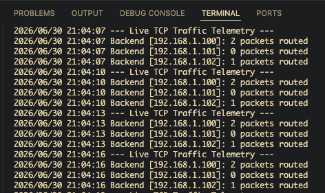
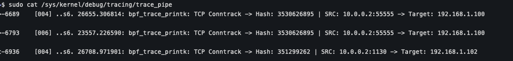

# XDP-LB: High-Performance Layer 4 Load Balancer

This is a from-scratch, kernel-level Layer 4 load balancer built to explore how hyperscale network systems route millions of packets per second. By leveraging **eBPF** and **XDP (eXpress Data Path)**, this project drops the heavy overhead of the standard Linux networking stack, intercepting and routing packets directly inside the Network Interface Card (NIC) driver.

## Architecture
The system is divided into two distinct decoupled layers:

* **The Data Plane (C):** A C program compiled to eBPF bytecode. It runs in the kernel, parsing raw Ethernet/IP/TCP memory structures, calculates hash on the network 5-tuple, and looking up routing decisions in $O(1)$ time.
* **The Control Plane (Go):** A user-space daemon built with `cilium/ebpf`. It autonomously detects active network interfaces, loads configurations, and orchestrates the kernel via shared eBPF Maps.

## ✨ Core Features
* **TCP Stickiness:** Uses a 5-Tuple (Src IP, Dst IP, Src Port, Dst Port, Protocol) Hash against a consistent hashing ring to guarantee TCP handshake integrity.
* **Kernel-Space to User-Space Telemetry:** Live traffic metrics are aggregated in kernel memory and polled asynchronously by Go.
* **Dynamic Auto-Configuration:** Reads backend pools from JSON and uses UDP dialing to autonomously detect the primary active host network interface.

## How to Run and Test

### 1. Prerequisites
You need a Linux environment with the eBPF toolchain installed:
```bash
sudo apt update
sudo apt install -y clang llvm libbpf-dev linux-headers-generic iproute2
```

### 2. Build the Project
The Makefile automatically generates the Go bindings from the C code and compiles the engine.
```bash
make clean && make
```

### 3. Setup the Testbed
To test ingress XDP safely without killing your main internet connection, create a virtual ethernet (veth) cable and a network namespace:
```bash
sudo ip link add veth-host type veth peer name veth-guest
sudo ip netns add xdp-test
sudo ip link set veth-guest netns xdp-test
sudo ip addr add 10.0.0.1/24 dev veth-host
sudo ip link set veth-host up
sudo ip netns exec xdp-test ip addr add 10.0.0.2/24 dev veth-guest
sudo ip netns exec xdp-test ip link set veth-guest up
sudo ip netns exec xdp-test ip link set lo up
```

### 4. Execute
Make sure your `config.json` interface is set to `veth-host` or `auto`.
Run the Go daemon (Terminal 1):
```bash
sudo ./xdp-lb
```



Watch the kernel trace logs (Terminal 2):
```bash
sudo cat /sys/kernel/debug/tracing/trace_pipe
```



### 5. Check TCP Stickiness
Fire traffic from the namespace (Terminal 3) by the same host and port.
```bash
# Simulating Client A (Should consistently hit Backend X)
sudo ip netns exec xdp-test nc -p 55555 -zv 10.0.0.1 80

# Simulating Client B (Should consistently hit Backend Y)
sudo ip netns exec xdp-test nc -p 66666 -zv 10.0.0.1 80
```

## Future Roadmap
* **Packet Mutation (XDP_TX):** Implement MAC address rewriting and IPIP encapsulation to achieve Direct Server Return (DSR), allowing the LB to forward packets out to physical hardware.
* **Active Health Checks:** Add a background worker in the Go control plane to ping backend servers and dynamically prune the Consistent Hashing Ring if a node dies.
* **LRU Connection Cache:** Implement a Least Recently Used (LRU) eBPF Map to handle IP fragmentation and graceful backend draining.

## Author
**Mohd Rashid** - [@mohdrashid9678](https://github.com/mohdrashid9678)

# Contributions are always welcomed. Just create an issue, and raise a PR against the issue.